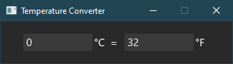
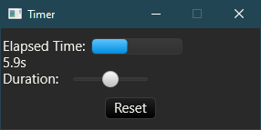
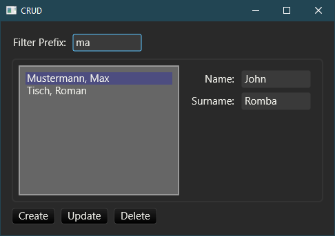

# Druid-7guis

## Rust implementation of the [7guis](https://eugenkiss.github.io/7guis/) tasks using [Druid](https://linebender.org/druid/)

###Counter  

###Temperature

###Flight Booker (Unfinished)   

###Timer

###CRUD

###Circles (WIP)

###Cells (Not started)